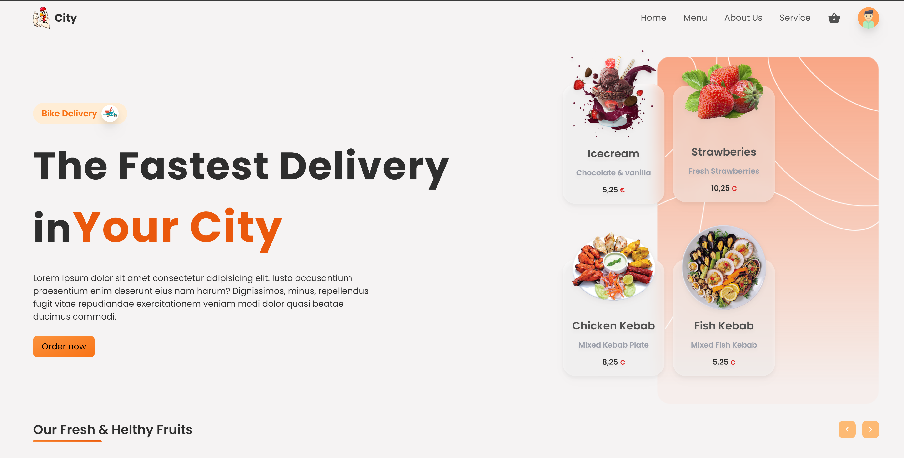

> Fullstack Food Delivery Application using ReactJS
> [Follow Us](https://github.com/frdrk00/)



# To check the node version

```
node --version
```

# To initialize the Firebase console 

```
firebase init
```

# To start the server

```
npm run server
```

# To create react project using npm & yarn

```
npm create-react-app folder_name
```

```
yarn create react-app folder_name
```

# To Start the client

```
yarn start
```

> Packages Used

<!-- prettier-ignore -->
| Name                  | Links | Description |
| --------------------- | ----- | ----------- |
| ReactJS               | [React](https://reactjs.org/) | React is a free and open source front-end JavaScript library for building user interfaces based on UI components. |
| Tailwind CSS          | [Tailwind](https://tailwindcss.com/) | TailwindCSS is a framework like no other. Rather than constraining you to a set design, it gives you the tools and the standardization to build exactly what you want.
| Firebase Functions    | [Functions](https://firebase.google.com/docs/functions) | Cloud Functions for Firebase is a serverless framework that lets you automatically run backend code in response to events triggered by Firebase features. |
| Express               | [Express](https://expressjs.com/) | Express.js, or simply Express, is a back and web application framework for Node.js, released as free and open-source software under the MIT License. It is designed for building web application and APIs. |
| React Router Dom      | [ReactRouterDom](https://reactrouter.com/en/main) | React Router Dom is an npm package that enables you to implement dynamic routing in a web app. It allows you to display pages and allow users to navigate them. |
| Framer Motion         | [FramerMotion](https://framer.com/motion/) | A production-ready motion library for React. Utilize the power behind Framer, the best prototyping tool for teams. Proudly open source. |
| React Icons           | [ReactIcons](https://react-icons.github.io/react-icons) | All Popular Icons in single package. |